**Assista meu vídeo sobre a resolução do desafio:** https://www.youtube.com/watch?v=osf6MJqHQIQ

## Resolução Desafio - PICK 2024_01

Este repositório contém a minha resolução do [desafio proposto](https://github.com/badtuxx/LINUXtips-PICK-24_01) pelo [@Badtuxx](https://github.com/badtuxx) para a Turma do PICK 2024.
A ideia principal do desafio é realizar a criação de um ambiente Kubernetes gerenciado e totalmente seguro para executar de maneira eficaz a aplicação **Giropops Senhas**
A aplicação **Giropops Senhas** é uma ferramenta desenvolvida pela LinuxTips durante live na Twitch para ajudar os usuários a criar senhas fortes e seguras de forma rápida e personalizada. Ela permite que você gere senhas aleatórias, escolhendo o tamanho das senhas, e se fará a inclusão de caracteres especiais e/ou números.
## Sumário desta Doc:

 - [Stack de Ferramentas](https://github.com/FabioBartoli/LINUXtips-PICK?tab=readme-ov-file#stack-de-ferramentas-tecnologias)
 - [Criação da Infraestrutura](https://github.com/FabioBartoli/LINUXtips-PICK?tab=readme-ov-file#stack-de-ferramentas-tecnologias)
 - [Diferentes formas para se criar uma imagem](https://github.com/FabioBartoli/LINUXtips-PICK?tab=readme-ov-file#diferentes-formas-para-se-criar-uma-imagem)
	 - [Primeiro Método: O build convencional](https://github.com/FabioBartoli/LINUXtips-PICK?tab=readme-ov-file#primeiro-m%C3%A9todo-o-build-convencional) 
	 - [Segundo Método: Build utilizando Imagens Distroless](https://github.com/FabioBartoli/LINUXtips-PICK?tab=readme-ov-file#segundo-m%C3%A9todo-build-utilizando-imagens-distroless)
	 - [Terceiro Método: Vamos criar uma imagem do zero?](https://github.com/FabioBartoli/LINUXtips-PICK?tab=readme-ov-file#terceiro-m%C3%A9todo-vamos-criar-uma-imagem-do-zero)
 - [Criando Deploys com o Helm](https://github.com/FabioBartoli/LINUXtips-PICK?tab=readme-ov-file#criando-deploys-com-o-helm)
 - [Garantindo a segurança com Kyverno](https://github.com/FabioBartoli/LINUXtips-PICK?tab=readme-ov-file#garantindo-a-seguran%C3%A7a-com-kyverno)
 - [Utilizando o Harbor para garantir imagens seguras](https://github.com/FabioBartoli/LINUXtips-PICK?tab=readme-ov-file#utilizando-o-harbor-para-garantir-imagens-seguras)
 - [Monitorando nossa Aplicação](https://github.com/FabioBartoli/LINUXtips-PICK?tab=readme-ov-file#monitorando-nossa-aplica%C3%A7%C3%A3o)
 - [Hora de Estressar!](https://github.com/FabioBartoli/LINUXtips-PICK?tab=readme-ov-file#hora-de-estressar)
	 - [Conhecendo o Kubernetes-based Event Driven Autoscaling - KEDA](https://github.com/FabioBartoli/LINUXtips-PICK?tab=readme-ov-file#conhecendo-o-kubernetes-based-event-driven-autoscaling---keda)
	 - [Stress Test com Locust](https://github.com/FabioBartoli/LINUXtips-PICK?tab=readme-ov-file#stress-test-com-locust)

Para resolver esse desafio, eu utilizei as seguintes ferramentas/ tecnologias:
### Stack de Ferramentas/ Tecnologias:

 - [APKO](https://github.com/chainguard-dev/apko)
 - [Distroless](https://edu.chainguard.dev/chainguard/chainguard-images/getting-started-distroless/)
 - [Docker](https://github.com/docker)
 - [Github Actions](https://github.com/features/actions)
 - [Harbor](https://github.com/goharbor/harbor)
 - [Helm](https://helm.sh/)
 - [KEDA](https://github.com/kedacore/keda)
 - [Kubernetes](https://kubernetes.io/pt-br/)
 - [Kyverno](https://kyverno.io/)
 - [Locust](https://locust.io/)
 - [Melange](https://github.com/chainguard-dev/melange)
 - [Metrics-Server](https://github.com/kubernetes-sigs/metrics-server)
 - [Nginx-Ingress](https://github.com/kubernetes/ingress-nginx)
 - [Prometheus Stack (+ Grafana)](https://github.com/prometheus-community/helm-charts)
 - [Terraform](https://www.terraform.io/)

### Criação da Infraestrutura
Eu me baseei em outro projeto que desenvolvi ainda durante o PICK2024 para a criação da infraestrutura da minha aplicação, o [k8s-with-ec2](https://github.com/FabioBartoli/k8s-with-ec2). A ideia deste projeto é criar um cluster kubernetes na AWS para estudos, provisionando e configurando máquinas EC2 pequenas utilizando Módulos Terraform + Github Actions, de maneira que esse cluster seja gratuito utilizando o [free tier](https://aws.amazon.com/free/?all-free-tier.sort-by=item.additionalFields.SortRank&all-free-tier.sort-order=asc&awsf.Free%20Tier%20Types=*all&awsf.Free%20Tier%20Categories=*all) da AWS. O projeto é aberto e você pode fazer um fork e configurar suas próprias credenciais para utilizá-lo :) Mais detalhes estão disponíveis na documentação do próprio projeto.
Mas, para esse desafio, as coisas são um pouco diferentes e, apesar de utilizar o mesmo "esqueleto" do Terraform, tive que fazer várias alterações para que o cluster criado suporte tudo que eu utilizarei, inclusive sendo necessário utilizar máquinas fora do free tier para que atendam aos requisitos mínimos do Kubernetes. 
Eu também adicionei em meu Terraform o provisionamento de um Application LoadBalancer e de registros DNS na minha Hosted Zone para apontarem para este LoadBalancer que estarei criando. Aqui, eu tentei "contornar" a utilização do EKS + Network Load Balancer, 2 recursos que possuem custos e não estão inclusos no free tier, pela utilização de instâncias EC2 gerenciadas pelo Kubeadm com um Application Load Balancer, que possui um período de 750 horas/ mês para utilização no Free Tier.
Em resumo, o cenário que eu quis montar foi para pagar o menos possível, em comparativo:
| Stack "Normal" - EKS + Instâncias + NLB             | Preço            | Stack "Manual", EC2 + ALB     | Preço                                  |
|-----------------------------------------------------|------------------|------------------------------------------------|----------------------------------------|
| EKS                                                 | $0,10/hora        | 4 Instâncias (1 CP + 3 Workers) - t3a.small     | (0,0188) * 4 = $0,0752/hora             |
| NLB                                                 | $0,0225/hora      | Application Load Balancer                       | 750 horas/mês grátis no Free Tier      |
| 4 Instâncias (1 CP + 3 Workers) - t3a.small         | (0,0188) * 4 = $0,0752/hora | |                                            |
| **Total**                                           | **$0,1977/hora**  | **Total**                                               |  **$0,0752/hora**                                       |  

O custo de se utilizar a Stack "Normal", se considerar que eu utilizaria 750 horas/ mês, seria de **$148,27 dólares**, enquanto utilizando a stack onde só estou pagando pelas EC2, será de **$56,40 dólares**, uma economia de **mais de 60%**
Claro que essa utilização de um Cluster "manual" possui diversos problemas e é ideal apenas para ambiente de estudos, para pouparmos a carteira 😊. No "mundo real", utilizo o EKS sem pensar duas vezes.
Voltando para a infraestrutura, o "grande truque" para se utilizar o Application Load Balancer é justamente o Nginx Ingress. Ao invés de criá-lo com o tipo default para cloud "LoadBalancer", eu estou criando nos padrões da utilização Bare Metal, criando um serviço "NodePort" e bindando 2 portas:

 - 30080 da máquina -> 80 do Ingress
 - 30443 da máquina -> 443 do Ingress

Quem vai fazer a mágica acontecer é o LoadBalancer: Eu tenho um listener manda as requisições da porta 80 em redirect para a 443, e as requisições da 443 eu encaminho para meu cluster EC2 usando um TargetGroup, diretamente para a porta 30443. E pra melhorar, como meu Application Load Balancer possui um certificado válido na porta 443, as aplicações que forem expostas pelo Ingress irão automaticamente já ter a confiança do meu certificado. 
No desenho abaixo eu tento explicar um pouco melhor tudo que foi feito:

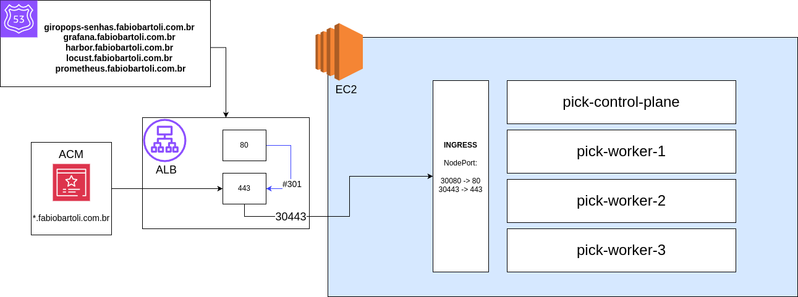

Para fazer o deploy da minha infra, eu tenho um [Pipeline CI/CD diretamente no meu Github Actions](./.github/workflows/deploy-infra.yml), e tudo que eu preciso para executá-lo são esses 4 valores:

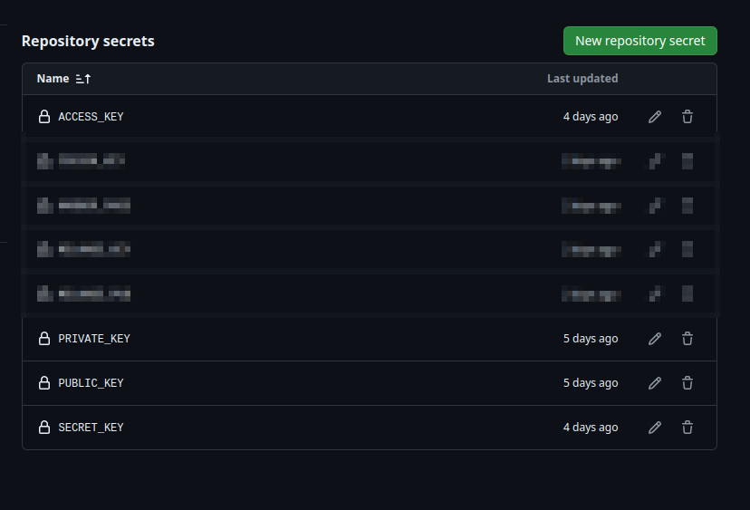

 - *ACCESS_KEY*: Access Key de um usuário do IAM que tenha permissão na AWS para criar e gerenciar instâncias, load balancers, buckets s3 e rotas no route53
 - *SECRET_KEY*: A secret desse usuário
 - *PRIVATE_KEY* e *PUBLIC_KEY* são literalmente uma key gerada em minha máquina local, codificadas em base64 e salvas como secrets no Github. Essas chaves serão utilizadas pelo Terraform para vincular nas EC2 e depois fechar um túnel SSH para fazer a instalação automática do meu Cluster Kubernetes, além da instalação do Helm no meu Worker, adição dos Repos Helm e afins.
Infra criada, vamos ver um pouco sobre a criação da Imagem
### Diferentes formas para se criar uma Imagem
A criação de um Dockerfile é uma prática bastante comum quando pensamos em colocar nossas aplicações para serem executadas em ambientes com orquestração. Temos diversas maneiras de gerar uma imagem como o próprio [Docker](https://www.docker.com/) que acabei de citar, o [Podman](https://podman.io/), e até mesmo a criação das nossas imagens "do zero". Nesse desafio, eu tenho 3 repositórios com a exata mesma aplicação onde eu irei aplicar técnicas de build da imagem diferente, para que possamos comparar os benefícios de cada uma.
#### Primeiro Método: O build convencional
[Nessa pasta](./app/normal-giropops-senhas), você vai encontrar o build mais convencional que costumamos fazer: pega uma imagem base, instalamos o que for necessário, definimos o entrypoint da nossa aplicação e sucesso! É uma forma válida de se fazer um deploy, mas vamos olhar para alguns dados:

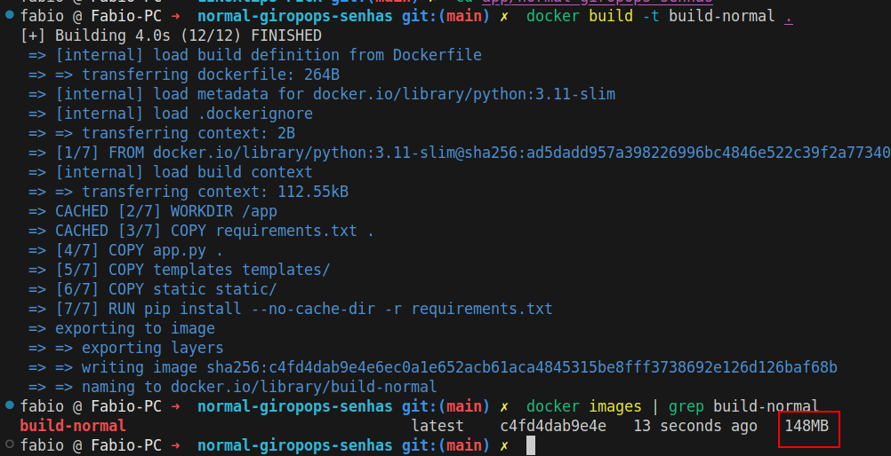

Então, pegamos uma imagem base do python, fizemos todo o processo que precisávamos para o build e construimos uma bela imagem de 148MB. No fim, temos uma imagem com **23 camadas** com o Debian sendo a imagem base:

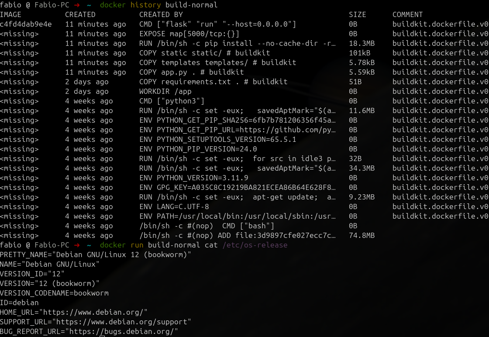

Perceba que o grande problema aqui é que, caso essa nossa imagem sofra um vazamento ou algo do tipo, qualquer pessoa poderá recuperar qualquer conteúdo que tenha nessas camadas, mesmo que ele tenha sido apagado antes do "build do container final". Além disso, estamos expostos a quaisquer vulnerabilidades que venham a surgir em pacotes nativos do sistema operacional base ou relacionados a alguma ferramenta que um dev venha a incluir nesse nosso Dockerfile. Vamos utilizar o Trivy, uma ferramenta de scan de vulnerabilidades para ver qual o "tamanho do problema" que temos em mãos:

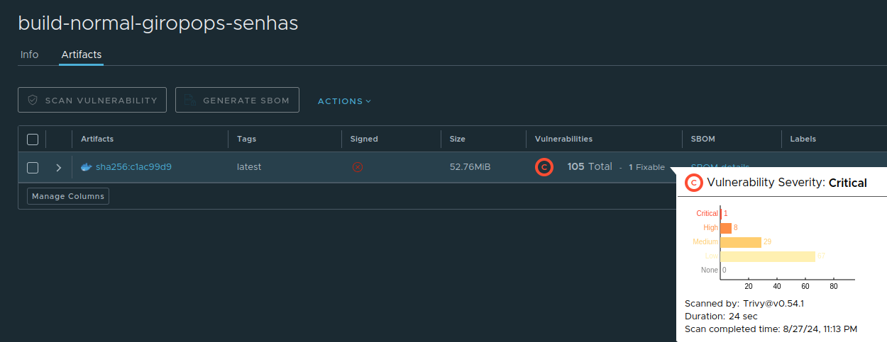

Então, temos 105 vulnerabiliadades encontradas, incluindo **1 CRÍTICA**, e dessas 105, apenas 1 possui um fix disponível, fix que com certeza será ou já foi lançado em uma imagem mais recente do python no DockerHub, mas mesmo assim ainda temos bastante coisa. Então, vamos olhar para o segundo cenário

#### Segundo Método: Build utilizando Imagens Distroless
Aqui, a ideia é ter imagens que tem apenas os pacotes necessários para rodar nossa aplicação, então, toda a parte dos pacotes do Sistema Operacional e etc que já discutimos antes já não são mais um problema pra gente. Com as imagens Distroless conseguimos ter mais confiabilidade nas nossas imagens criadas. Você pode [verificar aqui](./app/distroless-giropops-senhas/Dockerfile) como utilizei o distroless para criar o Dockerfile do giropops-senhas. Em resumo, utilizamos uma imagem base "builder" com um sistema operacional para fazer todo o processo de build da nossa aplicação e depois copiamos apenas os executáveis necessários para uma imagem do tipo [APKO](https://edu.chainguard.dev/open-source/build-tools/apko/getting-started-with-apko/) usando o conceito de [Docker Multi-Stage](https://docs.docker.com/build/building/multi-stage/)
Agora, vamos verificar como ficou nossa imagem:

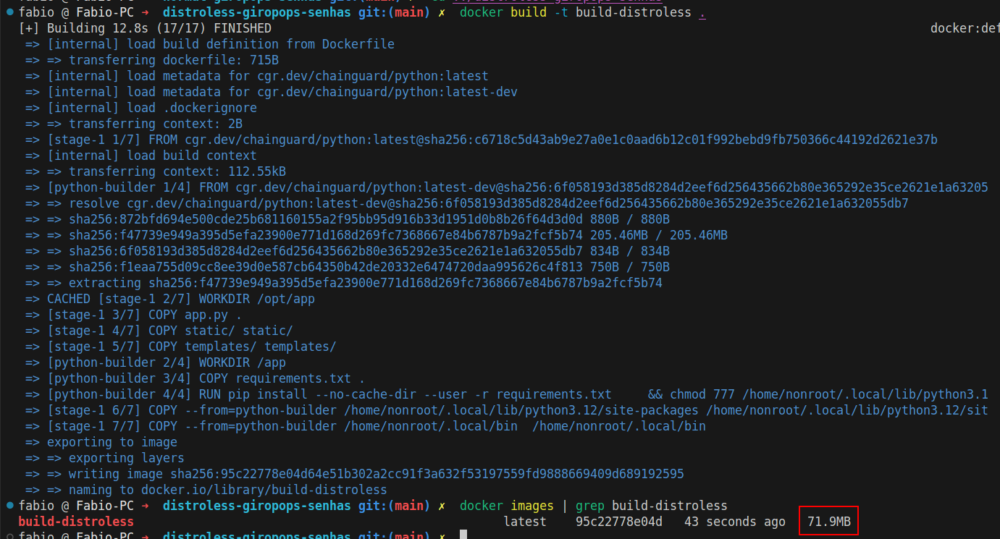

Perceba que o processo de build ficou um pouco mais complexo, mas já temos uma primeira mudança significante: Para a mesma aplicação, conseguimos diminuir para 72MB o tamanho da imagem. Praticamente, cortamos a primeira imagem gerada pela metade
E olhando para as camadas da imagem, também conseguimos perceber que elas reduziram significativamente: agora temos 11 camadas. Todo o processo realizado pelo container "builder" ficou contido dentro de uma única camada base chamada de "apko".

Outro ponto bem interessante de se notar é que agora eu não consigo mais executar o "cat /etc/os-release" para pegar o meu sistema operacional, pois esse pacote não vem instalado em nossa imagem final. A não presença de pacotes como *cat*, *wget*, *curl* em nossa imagem final é bem interessante quando olhamos para a segurança, visto que diminui a superfície de ataque em nossa imagem. Por fim, vamos verificar as vulnerabilidades pra ver o que temos por aqui..

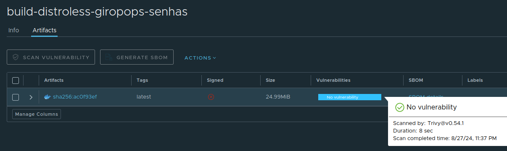

0 vulnerabilidades listadas! Isso mostra o trabalho da Chainguard em manter as imagens atualizadas com os pacotes mais recentes possíveis! Já temos algo bem interessante agora, certo? Mas conseguimos melhorar mais um pouco

#### Terceiro Método: Vamos criar uma imagem do zero?

Aqui, veremos um outra opção muito interessante que a Chainguard nos proporciona: ainda que utilizemos uma imagem base deles, podemos precisar de algo muito específico pra nossa aplicação executar corretamente e iremos acabar instalando em nossa imagem final. O resultado, como já sabemos, são mais camadas e mais possibilidades de termos pacotes que tenham dependências com vulnerabilidades.
Não só para esse cenário do exemplo, mas para qualquer outro, a seguinte alternativa pode ser interessante: que tal construirmos uma imagem do zero com os pacotes que precisamos especificamente para nossa aplicação e somente isso? Logicamente, estamos aumentando mais um pouco o grau de complexidade do nosso build, mas teremos melhores recompensas.
Para fazer esse processo, a Chainguard nos disponibiliza o [Melange](https://github.com/chainguard-dev/melange) ~~(não é a especiaria de Duna, é outro Melange)~~, uma ferramenta que permite criarmos nossa aplicação como um "pacote" junto com suas dependências necessárias e fazer o build disso. Para efeitos de entendimento, nosso processo de criação da imagem fica dividido entre:

 - [Criar o nosso pacote Melange](./security/melange/melange.yaml): Primeiro, vamos buildar nossa aplicação como um pacote com todas as dependências necessárias, e nada mais que isso
 - [Colocar nosso pacote para rodar em uma imagem APKO](./security/melange/apko.yaml): Copiamos nosso aplicação como um pacote para dentro de outra imagem, definimos o seu executável como entrypoint e temos nossa aplicação funcionando maravilhosamente

Dito isto, vou fazer o build da nossa imagem para ver o que acontece: 

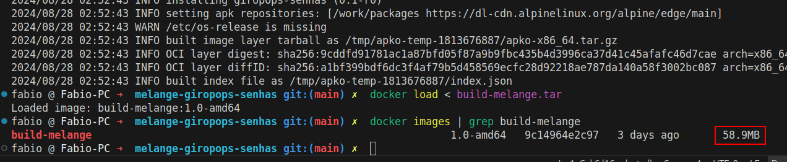

Podemos ver que a complexidade aumentou mais um pouco, pois agora é gerado um arquivo compactado da nossa aplicação que carregamos para o docker para poder utilizar. Mas já conseguimos diminuir para 59MB (a primeira tinha 148MB), agora sabemos que a imagem tem apenas o que precisamos para executar nossa aplicação. Mas agora, a cereja do bolo:

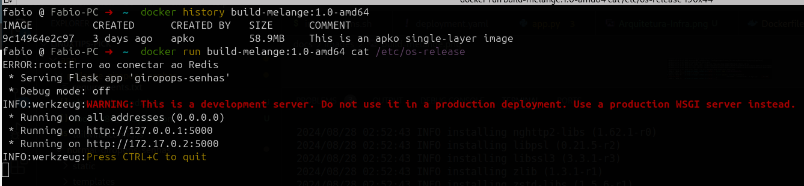

Nossa imagem tem APENAS UMA CAMADA apko. O que significa que todo nosso processo de buildar a imagem agora fica abstraído e nenhuma informação sobre isso pode ser descoberto na imagem final. Perceba também que agora o meu comando "docker run" com o "cat /etc/os-release" nem foi respeitado, pois nosso ponto de acesso é justamente a nossa aplicação, sem muitas possibilidades para cair dentro do container. Apenas para não restar dúvidas, vamos rodar o scan nela também:
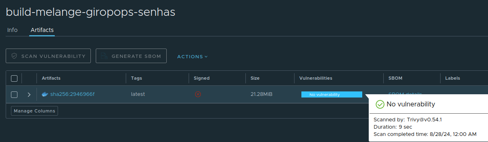

Também não temos vulnerabilidades. Para o restante deste desafio, eu irei trabalhar com a imagem do giropops-senhas criada via Melange
##
### Criando Deploys com o Helm
O Helm é um gerenciador de pacotes desenvolvido para facilitar o provisionamento de aplicações no Kubernetes. Assim como em um sistema operacional nós temos os gerenciadores, como por exemplo o "apt", o Helm tem quase a mesma função para o Kubernetes. Aqui, a ideia é que consigamos aplicar a mesma exata configuração para diferentes ambientes, alterando somente o que for necessário através do "values"
Durante esse laboratório, eu instalei os seguintes pacotes Helm:

    helm repo add prometheus-community https://prometheus-community.github.io/helm-charts
    helm repo add harbor https://helm.goharbor.io
    helm repo add kyverno https://kyverno.github.io/kyverno/
    helm repo add kedacore https://kedacore.github.io/charts

Todos esses pacotes são criados pelos próprios mantenedores das aplicações ou pela comunidade, com o intuito de tornar essas ferramentas fáceis de serem "instaladas" dentro do seu cluster. Mas também podemos criar os próprios pacotes para a nossa aplicação.
No meu caso, tenho duas stacks que podem tirar bom proveito dessa configuração compartilhada: os Ingress que eu irei criar para cada endpoint que ficará acessível, conforme eu demonstrei na [imagem](https://github.com/FabioBartoli/LINUXtips-PICK?tab=readme-ov-file#cria%C3%A7%C3%A3o-da-infraestrutura) acima, e também o giropops-senhas, que é composto por Aplicação + Redis.
Os dois Helms estão publicados aqui neste repositório mesmo e você pode conferir nos seguintes links:
[Helm Chart do Giropops-App](https://github.com/FabioBartoli/LINUXtips-PICK/tree/main/manifests/helm/giropops-app)
[Helm Chart do Ingress](https://github.com/FabioBartoli/LINUXtips-PICK/tree/main/manifests/helm/ingress)
A estrutura do meu Helm é basicamente a seguinte:

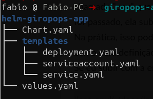

 - Chart.yaml - Definição de versão do Helm, aplicação, descrição e etc
 - Pasta "templates" - Onde ficam os arquivos que serão consumidos para a criação dos meus recursos
 - values.yaml: definição dos valores que serão inclusos em cada um dos recursos criados

Para fazer a instalação do Helm criado no meu Cluster, executei os seguintes comandos:

    ## Incluir os repos:
    helm repo add ingress https://fabiobartoli.github.io/LINUXtips-PICK/manifests/helm/ingress/
    helm repo add giropops-app https://fabiobartoli.github.io/LINUXtips-PICK/manifests/helm/giropops-app/
    # Helm Update:
    helm repo update
    # Instalar os pacotes:
    helm  install  ingress-controller  ingress/ingress-templates
    helm install giropops giropops-app/giropops-chart

No giropops-senhas, para simular uma instalação multi-ambiente, eu coloquei uma label chamada "env" que pode ser passada diretamente no comando de instalação do Helm. Se nada for passado, ela subirá como "dev". Se eu passar algum parâmetro, irá respeitar o que eu passei. Se eu subir com a env "stg", consigo verificar que ela realmente está aqui:

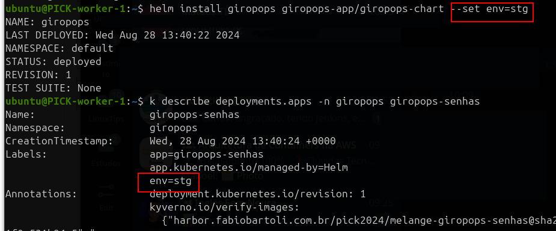

Na prática, isso poderia ser utilizado em diversos campos dentro do meu template do Helm, como para definição de quantidade de recursos alocados a depender do ambiente, por exemplo.
Mas antes de fazer o deploy da aplicação, precisamos configurar mais algumas coisas.

### Garantindo a segurança com Kyverno
O Kyverno é uma ferramenta que nos permite criar PolicyAsCode no nosso cluster Kubernetes. Com ela, conseguimos criar políticas declarativas para definir o que pode e o que não pode ser feito em nosso cluster. Podemos criar regras para o cluster como um todo "ClusterPolicy" ou apenas para um namespace específico "Policy". Na [documentação oficial](https://kyverno.io/docs/) do Kyverno, você pode ver diversos exemplos de políticas que são aplicáveis no cluster
No meu cenário, eu criei as seguintes políticas:

 - [disallow-root-user.yaml](./security/kyverno/disallow-root-user.yaml) - Não permite que nenhum container criado execute como o usuário root do container, com exceção dos containers criados nos namespaces das ferramentas que irei utilizar (kyverno, ingress-nginx, prometheus, por exemplo)
 - [disalow-default-ns.yaml](./security/kyverno/disalow-default-ns.yaml) - Não permite que nenhum container suba utilizando o namespace default do cluster, sem exceções
 - [allow-only-harbor-registry.yaml](./security/kyverno/allow-only-harbor-registry.yaml) - Permite que eu utilize apenas imagens que venham do meu registry Harbor
 - [harbor-signature.yaml](./security/kyverno/harbor-signature.yaml) - Além de permitir apenas do meu registry privado com a regra acima, essa verifica se a imagem foi assinada pelo Cosign utilizando uma chave válida
 - [require-probes.yaml](./security/kyverno/require-probes.yaml) - Não permite que nenhum container suba sem as probes definidas, com exceção dos containers criados nos namespaces das ferramentas que irei utilizar
 - [verify-sensitive-vars.yaml](./security/kyverno/verify-sensitive-vars.yaml) - Não permite que secrets sejam montadas como env dentro dos containers

Agora vamos testar essas políticas:
Primeiro, vou criar uma secret genérica apenas para fazer o teste de passá-la como variável:

    kubectl create secret generic minha-secret --from-literal=strigus=girus

E vamos criar um deploy totalmente genérico que tenta montar essa secret:

    apiVersion: apps/v1
    kind: Deployment
    metadata:
      name: nginx-deployment
    spec:
      replicas: 1
      selector:
        matchLabels:
          app: nginx
      template:
        metadata:
          labels:
            app: nginx
        spec:
          containers:
          - name: nginx
            image: nginx:latest
            env:
            - name: MINHA_SECRET
              valueFrom:
                secretKeyRef:
                  name: minha-secret
                  key: chave
            ports:
            - containerPort: 80

O resultado:

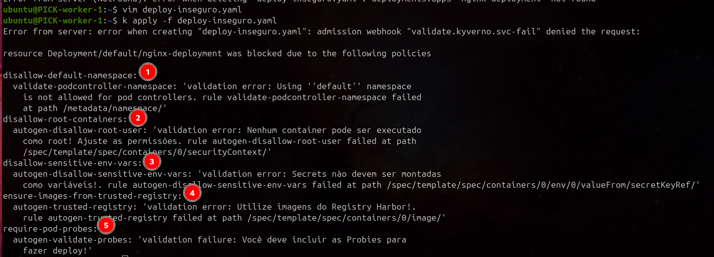

Já de cara, fomos bloqueados por 5 políticas diferentes, pois nosso deployment não está nos padrões permitidos para o cluster. Vamos ajustar as 5 políticas para verificar se dará tudo certo:

    apiVersion: apps/v1
    kind: Deployment
    metadata:
      name: nginx-deployment
      namespace: deploy-inseguro
    spec:
      replicas: 1
      selector:
        matchLabels:
          app: nginx
      template:
        metadata:
          labels:
            app: nginx
        spec:
          containers:
          - name: nginx
            image: harbor.fabiobartoli.com.br/pick2024/nginx-assinada
            ports:
            - containerPort: 80
            securityContext:
              runAsUser: 1000
              runAsGroup: 1000
              allowPrivilegeEscalation: false
            livenessProbe:
              httpGet:
                path: /
                port: 80
              initialDelaySeconds: 10
              periodSeconds: 10
            readinessProbe:
              httpGet:
                path: /
                port: 80
              initialDelaySeconds: 5
              periodSeconds: 5
          imagePullSecrets:
            - name: regcred

Perceba que eu estou passando agora uma imagem que realmente está disponível no meu registry privado, passando minha credencial para logar no registry privado e, ainda mais, está sim assinada:

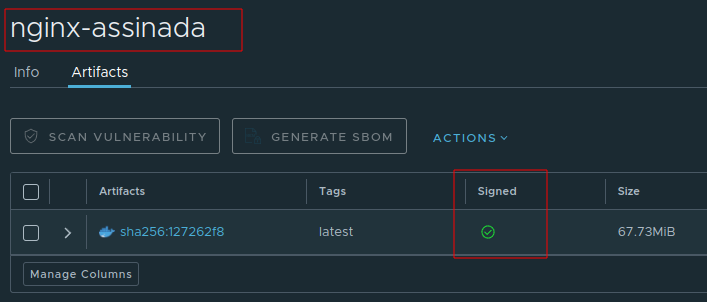

Só tem um problema... Eu assinei essa imagem com uma chave falsa! Uma chave que não possui relação de confiança com minha chave pública cadastrada na política "require-harbor-signature". Vamos ver se seremos identificados:

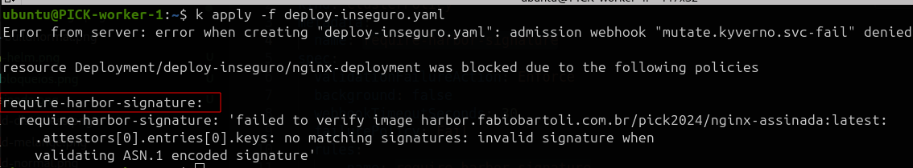

E sim, todas nosssas políticas estão funcionando maravilhosamente bem! Apenas pra não deixar passar, vou ajustar a assinatura dessa imagem e tentar realizar a criação do deployment novamente:

Nossas roles estão funcionando bem, então agora podemos finalmente fazer o deployment do Giropops-Senhas em si

### Utilizando o Harbor para garantir imagens seguras
Como já disse anteriormente, nessa stack que criei eu utilizei o Harbor como ferramenta para repositórios privados. O Harbor não estava incluso nos requisitos para o desafio, mas é uma ferramenta muito útil que me foi apresentada no PISC pelo professor [P0ssuidao](https://github.com/P0ssuidao) e que eu já estou utilizando no meu dia a dia.
Basicamente, o Harbor serve para armazenarmos nossas imagens de container, mas possui muitas outras funções que já facilitam demais a garantia de segurança nas imagens. Para esse desafio, eu configurei no Harbor os seguintes parâmetros:
 - Todas as imagens que eu faço push para o Harbor são automaticamente scanneadas pelo Trivy da Aquasecurity e o relatório fica disponível para mim
 - Qualquer imagem que estiver disponível no Harbor, só poderá ser utilizada por alguém com acesso, se ela não tiver NENHUMA vulnerabilidade dos níveis "LOW" para cima
 - Qualquer imagem que estiver disponível no Harbor, só poderá ser utilizada por alguém com acesso, se ela estiver assinada utilizando o Cosign. Essa configuração junto com a configuração de verificação da assinatura me fazem ter confiabilidade que minha imagem final é realmente a que eu construi, e não uma modificada.
Abaixo está o print das minhas configurações:

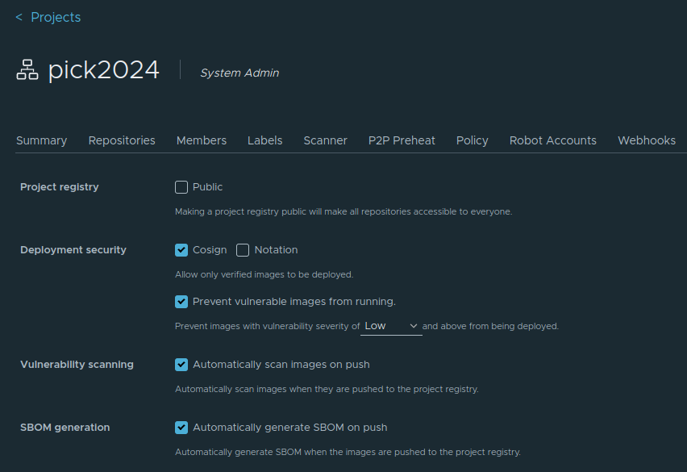

Com isso, tenho a garantia que minhas imagens da aplicação sempre estarão assinadas pelo **Cosign** e terão suas vulnerabilidades scanneadas pelo **Trivy**. Vamos partir para o deploy da imagem então.
Eu criei um pipeline CI/CD que é responsável pelo [build da imagem](./.github/workflows/build-image.yml) utilizando o Melange + APKO + Cosign + Harbor. Então, a ideia é que o desenvolvedor faça as alterações na sua aplicação que está dentro da pasta [app/melange-giropops-senhas](./app/melange-giropops-senhas), faça o commit para a branch desejada e rode a esteira de build para a construção da imagem no Harbor. O meu pipeline será responsável por:

 - Definir o ambiente baseado na branch: Para que possamos ter imagens
   de dev, stg e prd, o pipeline definirá o ambiente baseado na seguinte
   lógica: 
	 - Rodou o pipeline na branch "master", será buildada a imagem de produção (prd)
	 - Rodou o pipeline na branch "staging", será buildada a imagem de homologação/qa (stg)
	 - Rodou o pipeline em qualquer outra branch, será buildada a imagem de desenvolvimento (dev)
 - Montar as chaves para assinatura do Melange e do Cosign: Eu salvei como secrets em base64 no meu Github as chaves para montar a imagem do Melange e também para assinar a imagem final utilizando o Cosign. Essas são as secrets configuradas:
 
 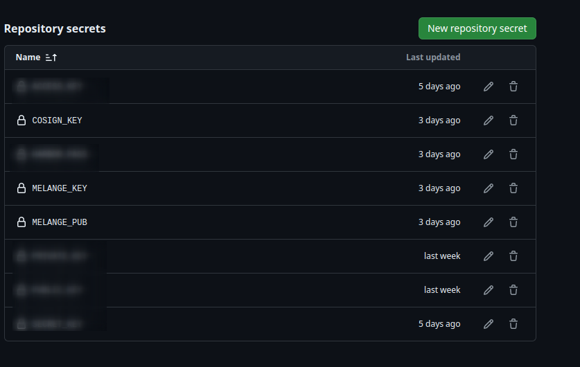
 
 - Realizar o processo de build do pacote com o Melange e build da imagem final via APKO: Para esse processo, eu estou utilizando containers com as imagens do Melange e do APKO por uma questão de facilidade, mas eu poderia instalar esses pacotes no meu runner do Github Actions se assim preferisse
 - Fazer o "docker login" no Harbor e a instalação do Cosign para assinatura da imagem
 - Realizar o tagueamento da imagem buildada, subir para o Harbor e fazer a assinatura dela
	 - Nesse step, eu tenho uma condicional para taguear a imagem como "latest" apenas se o build estiver sendo executado a partir da branch master, ou seja, o build produtivo

Agora sim, depois de executar o build e ter a imagem disponível no Harbor, podemos executar o Helm do nosso giropops-senhas! Manualmente eu também subi uma imagem do Redis disponibilizada pela Chainguard e fiz a assinatura dela. Podemos conferir os dados no nosso registry:

**giropops-senhas:**

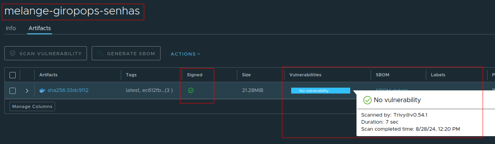

**redis:**

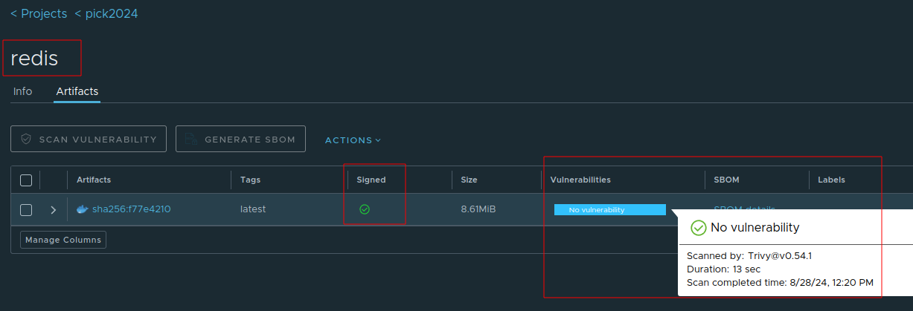

Instalando o nosso Helm:

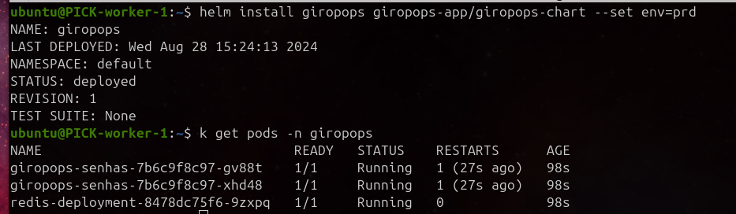
   
E por fim, acessando nosso ambiente, com certificado seguro:

 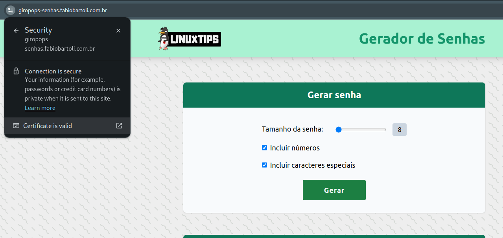

### Monitorando nossa Aplicação
Quase chegando no fim da construção do ambiente, vamos falar agora sobre monitoramento. Realizei a instalação da Stack Prometheus + Grafana no namespace "monitoring" do meu cluster com o comando abaixo:

    helm  install  kube-prometheus  prometheus-community/kube-prometheus-stack

Na aplicação giropops-senhas, eu fiz algumas adições no código de pontos que eu gostaria de monitorar. Você pode conferir em: [app.py](./app/melange-giropops-senhas/app.py)
Um resumo do que coloquei a mais para ser monitorado:

 - `senha_gerada_numeros`: Quero contar todas as senhas geradas que contém números
 - `senha_gerada_sem_numeros_counter`: Das senhas geradas, quantas não possuem números
 - `senha_gerada_caracteres_especiais`: Quero contar todas as senhas geradas que contém caracteres especiais
 - `senha_gerada_sem_caracteres_especiais_counter`: Das senhas geradas, quantas não possuem caracteres especiais
 - `redis_connection_error_counter`: Contador de erros de conexão com Redis
 - `tempo_gerar_senha`: Tempo que minha aplicação demora para responder com uma senha gerada
 - `tempo_resposta_api`: Tempo de resposta da API
 - `api_errors`: Contador de erros de API
 - `tamanho_fila_senhas`: Tamanho da fila de senhas no Redis que a aplicação está mantendo

Para monitorar o path /metrics da minha aplicação, eu criei o ServiceMonitor que você pode [conferir aqui](./monitoring/prometheus-metrics.yaml)

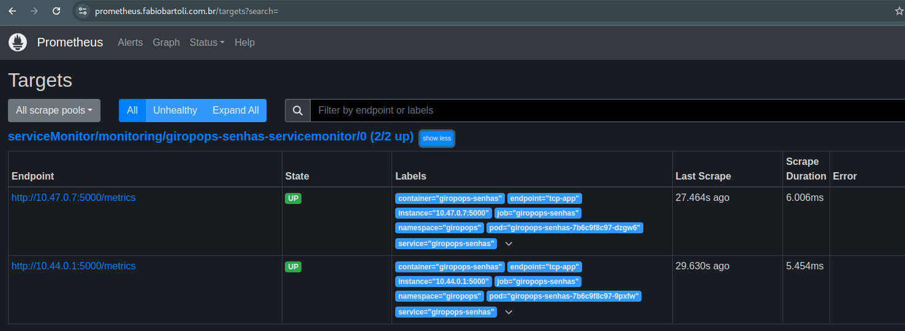

Usando o Grafana vinculado ao Prometheus, eu montei o seguinte gráfico para monitorar a utilização da minha aplicação:

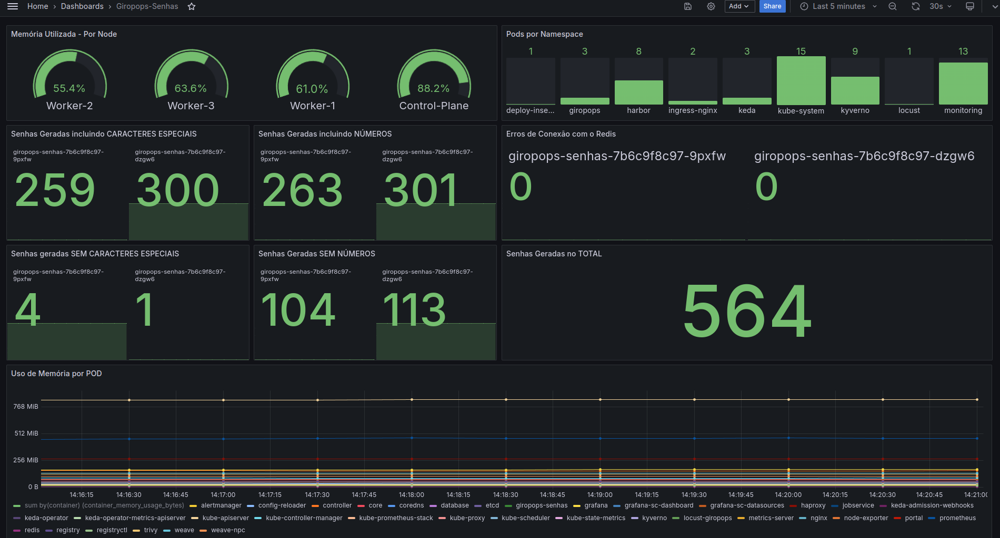
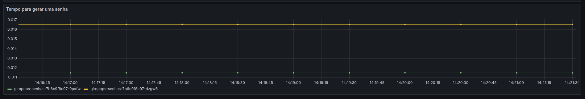

Também usei o Grafana para configurar um Alerta diretamente para o meu Telegram através de um Bot no caso do deployment da aplicação escalar para mais de 6 réplicas:

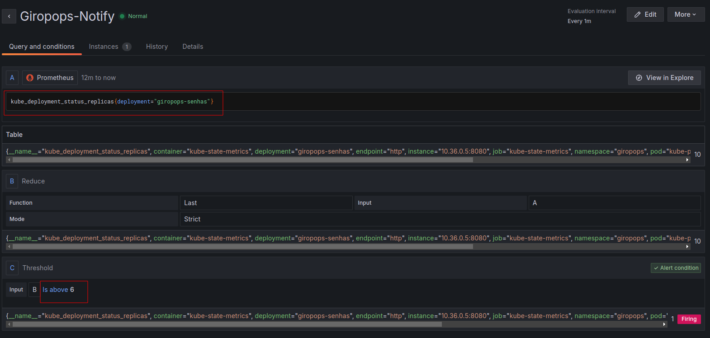
 
 Escalando meu deployment manualmente para 10 réplicas:
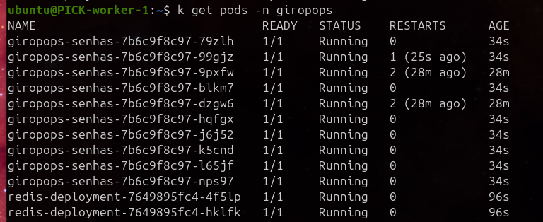

As mensagens já começam a chegar no meu Telegram:

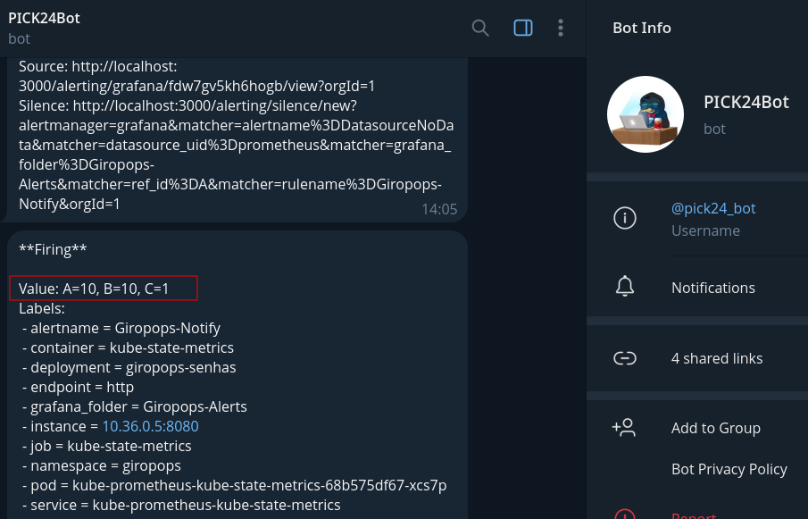

E quando o problema é resolvido:

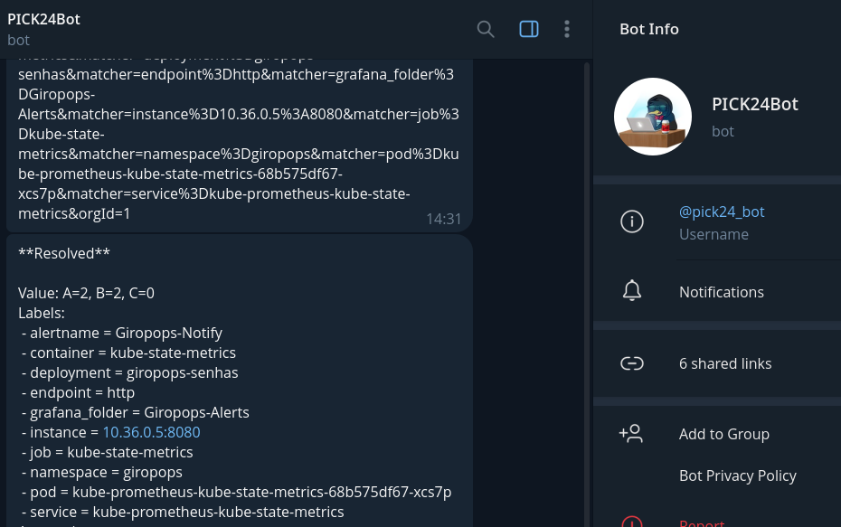

### Hora de Estressar!
Agora que a aplicação já está sendo devidamente monitorada, chegou a hora de criar uma política de AutoScaling para meu deployment e fazer uma carga de estresse nele!
Para isso, primeiramente vou precisar do [metrics-server](https://github.com/kubernetes-sigs/metrics-server) instalado no meu cluster, e por conta da minha instalação manual do kubernetes, eu preciso baixar o manifesto e passar o parâmetro "`--kubelet-insecure-tls`" para que o deployment suba corretamente. Então, posso aplicar ele no meu cluster com o comando: 

    kubectl  apply  -f  /home/ubuntu/LINUXtips-PICK/manifests/metrics-hpa/metrics-components.yaml

Metrics Server instalado, podemos aplicar também a política que criei para o Horizontal Pod Autoscaling do meu deployment:

    kubectl  apply  -f  /home/ubuntu/LINUXtips-PICK/manifests/metrics-hpa/hpa-giropops.senhas.yaml

Agora, antes de irmos para o stress test em si, tem outra coisa que precisamos notar na aplicação: Se eu fizer um scaling do meu deployment do giropops-senhas sem mexer na minha quantidade de pods do redis, o meu serviço não comporta, e os containers começam a dar "CrashLoopBackOff":

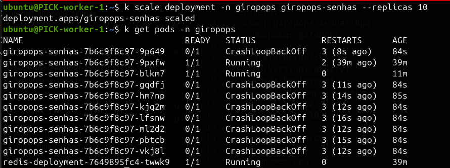

Precisamos garantir alguma estratégia para que o Deployment do redis acompanhe, de algum modo, o ScalingUp e ScalingDown do Deployment do giropops-senhas... mas como podemos fazer isso de uma forma automatizada?

#### Conhecendo o Kubernetes-based Event Driven Autoscaling - KEDA
O KEDA é um projeto reconhecido pela CNCF e que nos permite fazer Scaling de workloads baseados em eventos. Então, junto com o nosso Prometheus, por exemplo, conseguimos forçar o redis-deployment a fazer AutoScaling a medida que a aplicação giropops-senhas também fizer
A instalação do KEDA também é bem simples no meu cluster, sendo:

    helm repo add kedacore https://kedacore.github.io/charts
    helm repo update
    helm  install  keda  kedacore/keda  --namespace  keda  --create-namespace

Com ele devidamente provisionado, eu posso aplicar a política que criei para o Scaling do redis-deployment:

    apiVersion: keda.sh/v1alpha1
    kind: ScaledObject
    metadata:
      name: redis-scaledobject
      namespace: giropops
    spec:
      scaleTargetRef:
        kind: Deployment
        name: redis-deployment
      minReplicaCount: 1
      maxReplicaCount: 10
      cooldownPeriod:  60
      triggers:
      - type: prometheus
        metadata:
          serverAddress: http://kube-prometheus-kube-prome-prometheus.monitoring.svc.cluster.local:9090/
          metricName: giropops_senhas_replicas
          threshold: '3'
          query: |
            sum(kube_deployment_status_replicas{namespace="giropops",deployment="giropops-senhas"})

Com essa política, eu estou dizendo que, para cada 3 réplicas do deployment do giropops-senhas, o KEDA deve provisionar 1 deployment do redis. Assim, a minha carga de trabalho irá escalar de maneira que suporte a demanda da aplicação:

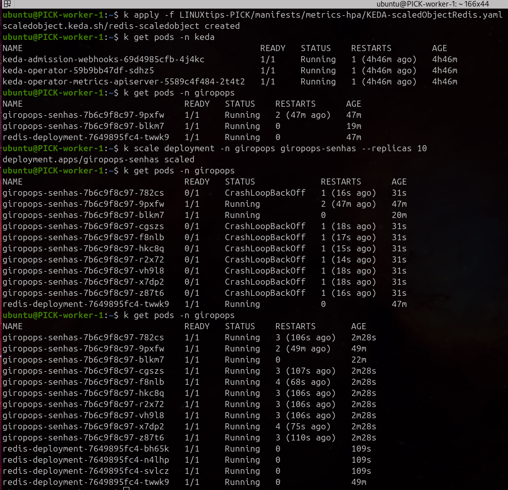

O contrário também irá acontecer: Assim que o HPA diminuir a necessidade de pods do nosso Deployment giropops-senhas, o KEDA também irá diminuir a quantidade de réplicas do redis-deployment:

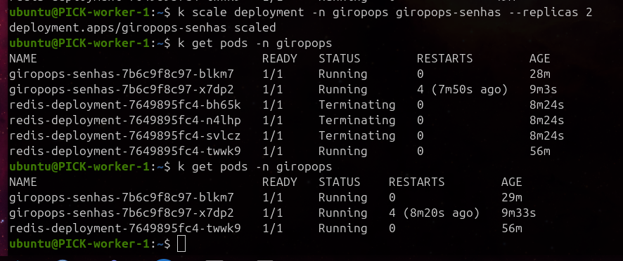

Agora sim, podemos rodar nosso Stress Test!

### Stress Test com Locust
O Locust é uma ferramenta OpenSource que permite executarmos carga de estresse em nossa aplicação. Com ela, conseguimos inclusive, criar scripts python para definir em quais paths queremos bater e o que queremos realizar dentro da aplicação
Você pode ver como o meu Locust está provisionado nos manifestos [dessa pasta](./manifests/locust)
Basicamente eu estou gerando 2 testes:

 - Ficar gerando senhas na API a partir da rota `/api/gerar-senha`
 - Ficar consultando as senhas através da rota `/api/senhas`

Através da interface web, vou fazer o Locust bater diretamente no Service do Giropops-Senhas. Como os dois serviços estão dentro do Cluster, farei isso pelo DNS interno para que eu não tenha problemas de carga na minha máquina ou ALB:

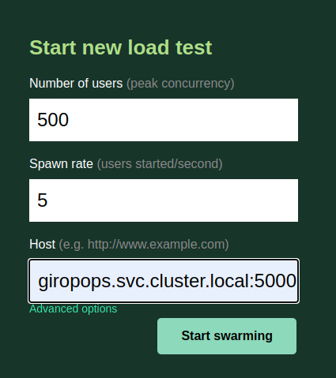

E após executar os testes, estes foram os resultados que eu obtive:
O meu HPA escalou conforme esperado, assim com o KEDA:
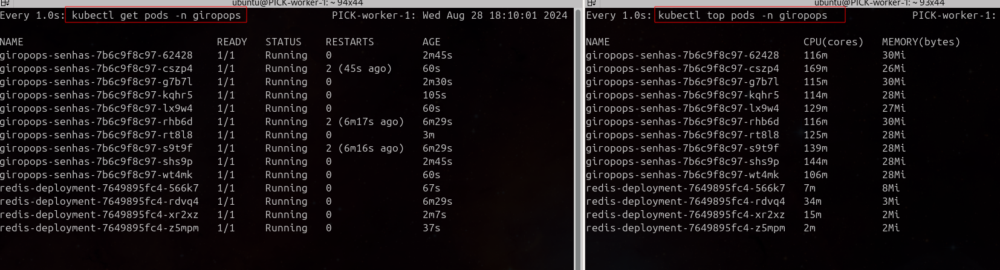

Grande parte das requisições passaram, mas após uma certa carga, a minha página /api/gerar-senha começou a retornar "Internal Server Error", mesmo a senha continuando a ser gerada

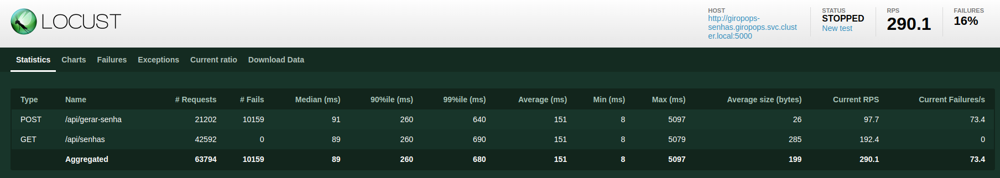

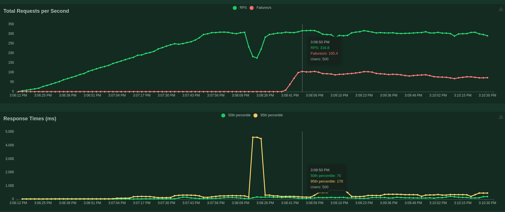

Olhando no Grafana:

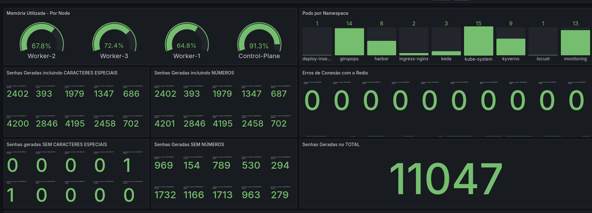

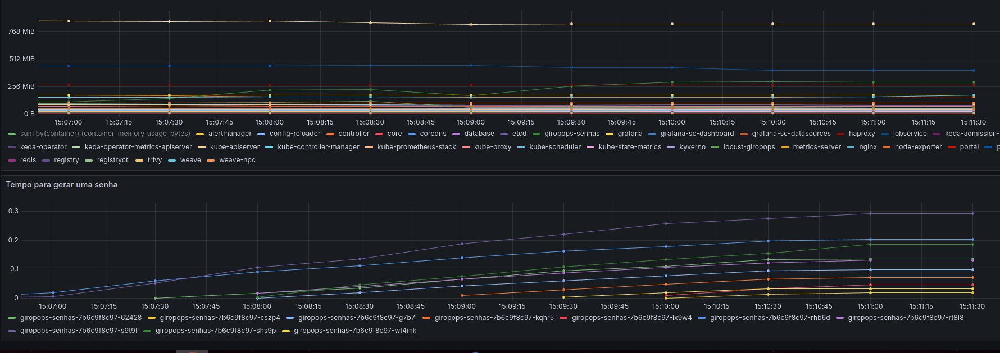

##
Com isso eu encerro a entrega do meu projeto do desafio e fico à disposição caso alguém queira entender melhor algum dos pontos que eu passei aqui, e também ficarei muito feliz caso possam contribuir me explicando coisas que eu esteja fazendo de maneira errada e qual seria a melhor alternativa.
Entrem em contato através do meu Telegram ou LinkedIn:

##
Esse projeto foi desenvolvido como parte do PICK - Programa Intensivo de Containers e Kubernetes - Turma 2024. [Saiba mais sobre](https://linuxtips.io/pick-2024/)
